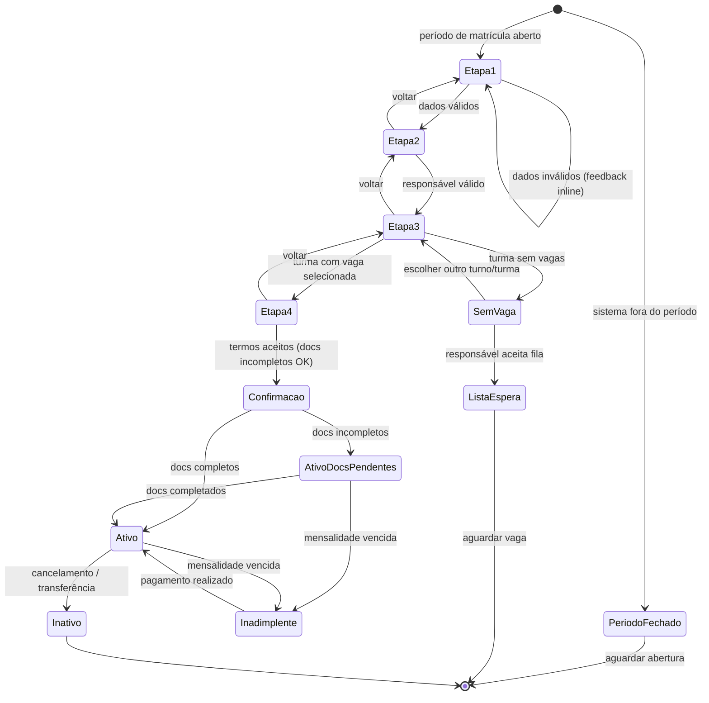

# Fluxo de Matrícula — Web + iOS

> Wizard de matrícula em 4 etapas para secretarias e diretores.
> Última revisão: 2026-04-12.

---

## Visão Geral do Fluxo

O processo de matrícula segue um wizard linear de 4 etapas com validação progressiva. O usuário só avança se todos os campos obrigatórios da etapa atual estiverem preenchidos corretamente.

```
[Dados do Aluno] → [Responsável] → [Turma / Série] → [Documentos] → [Confirmação]
      1                  2                3                 4              ✅
```

---

## Etapa 1 — Dados do Aluno

**Campos obrigatórios:**
- Nome completo
- Data de nascimento
- CPF (validado pelo algoritmo mod11)
- RG / RG de menor (número + órgão expedidor)
- Certidão de nascimento (número + livro + folha)
- Endereço completo (CEP com auto-preenchimento via ViaCEP)
- Naturalidade (cidade e estado)
- Nacionalidade

**Campos opcionais:**
- Foto do aluno (upload JPEG/PNG, max 5MB)
- Necessidades especiais / laudo médico (upload PDF)
- Escola de origem

**Validações:**
- CPF não pode já estar cadastrado no sistema (verifica duplicata)
- Data de nascimento deve ser compatível com a série selecionada
- CEP deve ser válido (chama API ViaCEP)

**Wireframe — Web:**
```
┌── Etapa 1 de 4: Dados do Aluno ────────────────────────────────────┐
│  ●────────────────────────────────────                             │
│  1        2        3        4                                      │
│                                                                     │
│  Nome completo *                                                    │
│  [Lucas Martins Ferreira                                    ]      │
│                                                                     │
│  Data de nascimento *          CPF *                               │
│  [15/03/2011        ]          [   .   .   -              ]       │
│                                                                     │
│  RG *                          Órgão expedidor *                   │
│  [45.678.901-3      ]          [SSP/SP          ]                  │
│                                                                     │
│  CEP *                                                              │
│  [14020-010  ] → Rua das Flores, Jardim América, Ribeirão Preto   │
│                                                                     │
│  Número *          Complemento                                      │
│  [123       ]      [Apto 45                     ]                  │
│                                                                     │
│                              [Cancelar]  [Próximo →]               │
└────────────────────────────────────────────────────────────────────┘
```

---

## Etapa 2 — Responsável

**Campos obrigatórios:**
- Nome completo do responsável
- Grau de parentesco (Pai / Mãe / Avó/Avô / Tutor legal / Outro)
- CPF do responsável
- Telefone principal (com DDD)
- E-mail (para receber comunicados e acesso ao app)

**Campos opcionais:**
- Segundo responsável (dados completos)
- Telefone secundário
- Observações de contato

**Validações:**
- Se CPF do responsável já existe no sistema, preenche campos automaticamente (re-matrícula de irmão).
- E-mail único por responsável (dispara convite de acesso ao app após confirmação).

**Wireframe — Web:**
```
┌── Etapa 2 de 4: Responsável ───────────────────────────────────────┐
│  ─●───────────────────────────────                                 │
│  1        2        3        4                                      │
│                                                                     │
│  Responsável financeiro e pedagógico                                │
│                                                                     │
│  Nome completo *                                                    │
│  [Roberto Henrique Alves                                    ]      │
│                                                                     │
│  Parentesco *                  CPF *                               │
│  [Pai              ▼]          [   .   .   -              ]       │
│                                                                     │
│  Telefone *                    E-mail *                            │
│  [(16) 99999-1234  ]           [roberto@email.com         ]       │
│                                                                     │
│  ☐ Adicionar segundo responsável                                    │
│                                                                     │
│                          [← Voltar]  [Próximo →]                   │
└────────────────────────────────────────────────────────────────────┘
```

---

## Etapa 3 — Turma / Série

**Campos obrigatórios:**
- Série / Ano (1º Ano EF, 2º Ano EF, ..., 3º Ano EM)
- Turno (Manhã / Tarde / Integral)
- Turma (gerada automaticamente com base na série + turno + vagas)

**Informações exibidas (somente leitura):**
- Vagas disponíveis na turma selecionada
- Nome do professor de referência
- Horário de entrada e saída
- Valor da mensalidade (calculado automaticamente com base na série)

**Validações:**
- Se não há vagas disponíveis na combinação série+turno, exibe alerta e opção de lista de espera.
- Verifica se o período de matrícula está aberto (configurável em Configurações > Ano Letivo).
- Valida compatibilidade de idade com a série (±2 anos como tolerância).

**Wireframe — Web:**
```
┌── Etapa 3 de 4: Turma / Série ─────────────────────────────────────┐
│  ──────●──────────────────────                                     │
│  1        2        3        4                                      │
│                                                                     │
│  Série *                       Turno *                             │
│  [6º Ano — Ensino Fund. ▼]    [Tarde           ▼]                 │
│                                                                     │
│  Turma disponível:                                                  │
│  ┌─────────────────────────────────────────────────────────────┐  │
│  │  ◉  6B — Tarde                                               │  │
│  │     Professor ref.: Carlos Eduardo Motta                    │  │
│  │     Horário: 13h00 – 17h30                                   │  │
│  │     Vagas: 3 disponíveis de 35                               │  │
│  │     Mensalidade: R$ 950,00/mês                               │  │
│  └─────────────────────────────────────────────────────────────┘  │
│                                                                     │
│  ⚠️  6A – Tarde: Sem vagas disponíveis (lista de espera)          │
│                                                                     │
│                          [← Voltar]  [Próximo →]                   │
└────────────────────────────────────────────────────────────────────┘
```

---

## Etapa 4 — Documentos

**Documentos obrigatórios (upload PDF/JPEG, max 10MB cada):**
- Certidão de nascimento
- CPF do aluno (ou RG)
- Comprovante de residência (máx. 3 meses)
- Histórico/Declaração de transferência (para novos alunos de outra escola)
- 2 fotos 3x4

**Documentos opcionais:**
- Cartão de vacinação
- Laudo médico / diagnóstico (PCD)
- Declaração de guarda exclusiva (se aplicável)

**Aceite de termos:**
- ☐ Li e aceito os Termos de Uso e Política de Privacidade (LGPD)
- ☐ Autorizo o uso de imagem do aluno para material institucional
- ☐ Confirmo que os dados fornecidos são verdadeiros

**Wireframe — Web:**
```
┌── Etapa 4 de 4: Documentos ────────────────────────────────────────┐
│  ────────────●────────────────                                     │
│  1        2        3        4                                      │
│                                                                     │
│  Documentos obrigatórios                                            │
│                                                                     │
│  ✅ Certidão de nascimento     certidao_lucas.pdf    [Remover]     │
│  ✅ CPF do aluno               cpf_lucas.jpg         [Remover]     │
│  ❌ Comprovante de residência   [+ Fazer upload]                    │
│  ❌ Histórico/Transferência     [+ Fazer upload]                    │
│  ❌ Fotos 3x4 (2 unidades)      [+ Fazer upload]                    │
│                                                                     │
│  Documentos opcionais          [+ Adicionar documento]             │
│                                                                     │
│  Termos e autorizações                                              │
│  ☑ Li e aceito os Termos de Uso e Política de Privacidade (LGPD)  │
│  ☐ Autorizo uso de imagem para material institucional              │
│  ☑ Confirmo que os dados fornecidos são verdadeiros               │
│                                                                     │
│  ⚠️  3 documentos pendentes. Você pode completar depois.            │
│                                                                     │
│                    [← Voltar]  [Concluir Matrícula]                │
└────────────────────────────────────────────────────────────────────┘
```

---

## Tela de Confirmação (pós-matrícula)

```
┌── Matrícula Realizada com Sucesso! ────────────────────────────────┐
│                                                                     │
│                        ✅                                           │
│              Matrícula confirmada!                                  │
│                                                                     │
│  Lucas Martins Ferreira                                             │
│  6º Ano — Turma 6B — Tarde                                         │
│  Número de matrícula: RA 23045                                      │
│                                                                     │
│  Um e-mail de confirmação foi enviado para roberto@email.com        │
│  Roberto também receberá um convite para instalar o app.            │
│                                                                     │
│  Documentos pendentes: 3   [Completar documentação]                │
│                                                                     │
│  [Ver perfil do aluno]         [Nova matrícula]                    │
└────────────────────────────────────────────────────────────────────┘
```

---

## Diagrama de Estado (Mermaid)



---

## Regras de Negócio

### Vagas
- Cada turma tem capacidade máxima configurável (padrão: 35 alunos).
- Quando a turma atinge 100% da capacidade, bloqueia novas matrículas e oferece lista de espera.
- Alerta automático para a secretaria quando turma atinge 90% da capacidade.
- Lista de espera em ordem de cadastro (FIFO). Responsável é notificado por push/e-mail quando uma vaga abre.

### Período de Matrícula
- Configurado em Configurações > Ano Letivo > Período de Matrícula.
- Fora do período, apenas rematrículas de alunos já matriculados são permitidas.
- Período de rematrícula (renovação): prioritariamente para alunos do ano anterior.
- Possibilidade de matrícula fora do período via liberação manual pela direção.

### Documentos Obrigatórios
- A matrícula pode ser **salva com documentos pendentes** por até 30 dias.
- Após 30 dias sem documentação completa, matrícula entra em status "Pendente de regularização".
- A secretaria recebe alerta semanal de matrículas com documentação incompleta.

### Compatibilidade de Idade com Série
- EF Anos Iniciais (1º-5º Ano): 6-11 anos até 31/03 do ano letivo.
- EF Anos Finais (6º-9º Ano): 11-15 anos.
- EM (1º-3º Ano): 15-18 anos.
- Fora da faixa: exibe aviso, mas secretaria pode prosseguir com justificativa.

### Duplicata de CPF
- Se o CPF do aluno já existe, exibe alerta de duplicata com link para o perfil existente.
- Secretaria pode confirmar que é o mesmo aluno (rematrícula após saída) ou cancelar.

### Envio de Convite ao Responsável
- Após matrícula confirmada, sistema envia e-mail automático para o responsável com:
  - Confirmação da matrícula
  - Link de download do app Lexend Scholar (iOS/Android)
  - Credenciais de acesso iniciais (e-mail + senha temporária)
- Push notification não é enviado antes da instalação do app.
