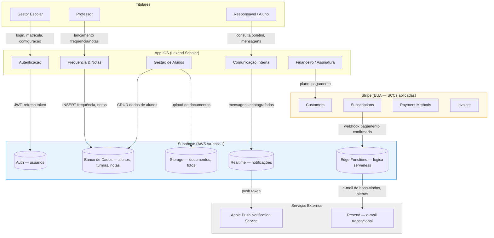

# Mapeamento de Fluxo de Dados — Lexend Scholar

> **Ref:** LS-100 | LGPD Art. 37 | Atualizado: 2026-04-12
> **Classificação:** Confidencial — uso interno e DPO

---

## 1. Visão Geral do Ecossistema

O Lexend Scholar processa dados pessoais em três camadas principais:

1. **App iOS** — interface primária para gestores, professores e responsáveis
2. **Supabase (PostgreSQL + Auth + Storage)** — backend/banco de dados hospedado na AWS São Paulo (sa-east-1)
3. **Stripe** — processamento de pagamentos (dados financeiros)

---

## 2. Diagrama de Fluxo de Dados (Mermaid)



---

## 3. Fluxos Detalhados por Categoria de Dado

### 3.1 Dados de Autenticação

| Dado | Origem | Destino | Finalidade | Base Legal | Retenção |
|------|--------|---------|-----------|-----------|---------|
| E-mail | Usuário (cadastro) | Supabase Auth | Identificação e login | Execução de contrato (Art. 7º, V) | Duração da conta + 5 anos |
| Hash de senha | App iOS | Supabase Auth (bcrypt) | Autenticação segura | Execução de contrato | Duração da conta |
| JWT / Refresh Token | Supabase Auth | App iOS (Keychain) | Sessão autenticada | Execução de contrato | 7 dias (refresh) / 1h (access) |
| IP de login | Rede do dispositivo | Supabase logs | Segurança / auditoria | Legítimo interesse (Art. 7º, IX) | 90 dias |
| Dispositivo (modelo, OS) | App iOS | Supabase logs | Suporte técnico | Legítimo interesse | 90 dias |

### 3.2 Dados de Alunos (Titulares Vulneráveis — Art. 14 LGPD)

| Dado | Origem | Destino | Finalidade | Base Legal | Retenção |
|------|--------|---------|-----------|-----------|---------|
| Nome completo | Gestor (cadastro) | Supabase DB | Identificação do aluno | Execução de contrato com escola | Enquanto matrícula ativa + 5 anos |
| Data de nascimento | Gestor (cadastro) | Supabase DB | Verificação de idade, relatórios pedagógicos | Execução de contrato | Enquanto matrícula ativa + 5 anos |
| CPF (quando menor) | Gestor (cadastro) | Supabase DB (criptografado) | Documentação legal, emissão de declarações | Obrigação legal (Art. 7º, II) | 5 anos após encerramento |
| Foto do aluno | Gestor / Upload | Supabase Storage | Identificação visual | Consentimento dos responsáveis (Art. 7º, I) | Enquanto matrícula ativa |
| Endereço residencial | Gestor (cadastro) | Supabase DB | Cadastro escolar | Execução de contrato | Enquanto matrícula ativa + 5 anos |
| Contato do responsável | Gestor (cadastro) | Supabase DB | Comunicação escola-família | Execução de contrato | Enquanto matrícula ativa + 5 anos |
| Necessidades especiais / laudos | Gestor (cadastro) | Supabase DB (criptografado) | Atendimento pedagógico diferenciado | Consentimento específico (Art. 11, II) | Enquanto matrícula ativa |

### 3.3 Dados Pedagógicos

| Dado | Origem | Destino | Finalidade | Base Legal | Retenção |
|------|--------|---------|-----------|-----------|---------|
| Frequência (presença/falta) | Professor (app) | Supabase DB | Controle pedagógico e legal | Execução de contrato | 5 anos (LDB Art. 9º) |
| Notas e avaliações | Professor (app) | Supabase DB | Registro pedagógico | Execução de contrato | 5 anos |
| Boletim escolar (PDF) | Gerado pelo sistema | Supabase Storage | Comunicação com responsável | Execução de contrato | 5 anos |

### 3.4 Dados de Comunicação

| Dado | Origem | Destino | Finalidade | Base Legal | Retenção |
|------|--------|---------|-----------|-----------|---------|
| Mensagens internas | Escola / Responsável | Supabase Realtime DB | Comunicação pedagógica | Execução de contrato | 2 anos |
| Notificações push | Sistema | Apple APN (token anônimo) | Alertas de frequência, notas | Execução de contrato | Sessão / até revogação |
| E-mails transacionais | Sistema | Resend → caixa do usuário | Confirmações, alertas | Execução de contrato | Não retido (send-only) |

### 3.5 Dados Financeiros

| Dado | Origem | Destino | Finalidade | Base Legal | Retenção |
|------|--------|---------|-----------|-----------|---------|
| Nome do titular do cartão | Gestor (checkout) | Stripe (nunca Supabase) | Cobrança da assinatura | Execução de contrato | Controlado pelo Stripe |
| Número do cartão (tokenizado) | Stripe.js/SDK | Stripe (PCI-DSS L1) | Cobrança recorrente | Execução de contrato | Controlado pelo Stripe |
| CNPJ / CPF da escola | Gestor (cadastro) | Supabase DB + Stripe | Emissão de nota fiscal, KYC | Obrigação legal | 5 anos |
| Histórico de pagamentos | Stripe webhook | Supabase DB | Controle de acesso, relatórios | Execução de contrato + Obrigação legal | 5 anos |

---

## 4. Controle de Acesso a Dados de Alunos

### 4.1 Quem acessa dados de alunos?

| Perfil | Acesso permitido | Controle técnico |
|--------|-----------------|-----------------|
| Gestor Escolar | Todos os alunos da sua escola | RLS: `school_id = auth.school_id()` |
| Professor | Apenas alunos das suas turmas | RLS: `class_id IN (professor's classes)` |
| Responsável | Apenas seus filhos cadastrados | RLS: `student_id IN (guardian's students)` |
| Suporte Lexend | Visualização limitada mediante solicitação formal | Acesso via service role com log mandatório |
| Supabase (infra) | Dados criptografados em repouso | AES-256, chaves gerenciadas pela AWS KMS |

### 4.2 Row Level Security (RLS) no Supabase

Todas as tabelas com dados pessoais possuem RLS habilitado. Políticas principais:

```sql
-- Exemplo: tabela students
ALTER TABLE students ENABLE ROW LEVEL SECURITY;

-- Gestor vê apenas alunos da sua escola
CREATE POLICY "gestor_escola" ON students
  FOR ALL USING (school_id = get_current_school_id());

-- Professor vê apenas alunos das suas turmas
CREATE POLICY "professor_turmas" ON students
  FOR SELECT USING (
    id IN (
      SELECT student_id FROM class_enrollments ce
      JOIN classes c ON ce.class_id = c.id
      WHERE c.teacher_id = auth.uid()
    )
  );

-- Responsável vê apenas seus filhos
CREATE POLICY "responsavel_filho" ON students
  FOR SELECT USING (
    id IN (
      SELECT student_id FROM guardians
      WHERE user_id = auth.uid()
    )
  );
```

### 4.3 Dados que NUNCA saem do banco

- CPF de alunos: criptografado com `pgcrypto`, descriptografado apenas na camada de Edge Functions
- Laudos médicos: armazenados criptografados no Supabase Storage com acesso signed-URL de curta duração (15 min)
- Senhas: nunca armazenadas em texto plano (bcrypt via Supabase Auth)

---

## 5. Exportações de Dados

| Tipo de exportação | Quem pode | Formato | Log de auditoria |
|--------------------|-----------|---------|-----------------|
| Boletim do aluno (PDF) | Responsável, Gestor | PDF gerado no servidor | Sim — tabela `audit_exports` |
| Relatório de frequência | Gestor, Professor | CSV / PDF | Sim — tabela `audit_exports` |
| Exportação completa da escola (DSAR portabilidade) | Gestor (solicitação formal) | JSON / CSV compactado | Sim — via processo DSAR (LS-103) |
| Dados via API (integrações futuras) | Gestor (OAuth2 autorizado) | JSON | Sim — API access logs |

**Tabela de auditoria:**
```sql
CREATE TABLE audit_exports (
  id UUID PRIMARY KEY DEFAULT gen_random_uuid(),
  user_id UUID REFERENCES auth.users(id),
  school_id UUID REFERENCES schools(id),
  export_type TEXT NOT NULL,
  records_count INTEGER,
  ip_address INET,
  created_at TIMESTAMPTZ DEFAULT NOW()
);
```

---

## 6. Transferências Internacionais

| Sub-operador | País | Dados transferidos | Garantia legal |
|---|---|---|---|
| Supabase / AWS | Brasil (sa-east-1) | Todos os dados pessoais | Armazenamento local — sem transferência internacional |
| Stripe | EUA | Dados financeiros e de pagamento | Standard Contractual Clauses (SCCs) UE–EUA; acordos bilaterais Brasil–EUA |
| Apple (APNS) | EUA | Push token (pseudonimizado) | SCCs; dados mínimos necessários |
| Resend | EUA | E-mail e nome do destinatário | SCCs |

---

## 7. Responsabilidades

| Ator | Papel LGPD | Responsabilidade |
|------|-----------|-----------------|
| Escola cliente | Controladora | Define finalidade do tratamento dos dados de alunos |
| Lexend Scholar | Operadora | Executa tratamento conforme instrução da escola (DPA — LS-102) |
| Supabase Inc. | Sub-operadora | Infraestrutura de dados conforme contrato com Lexend |
| Stripe Inc. | Operadora independente (dados financeiros) | Processamento de pagamentos, PCI-DSS |

---

*Documento a ser revisado semestralmente ou após mudanças arquiteturais. Responsável: DPO + CTO.*
